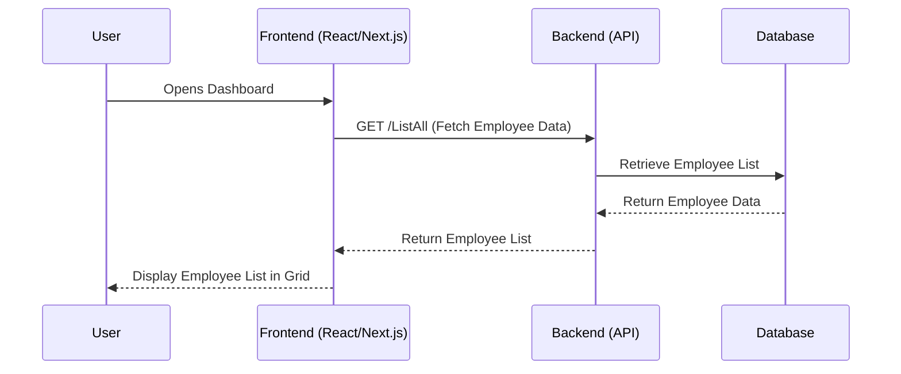
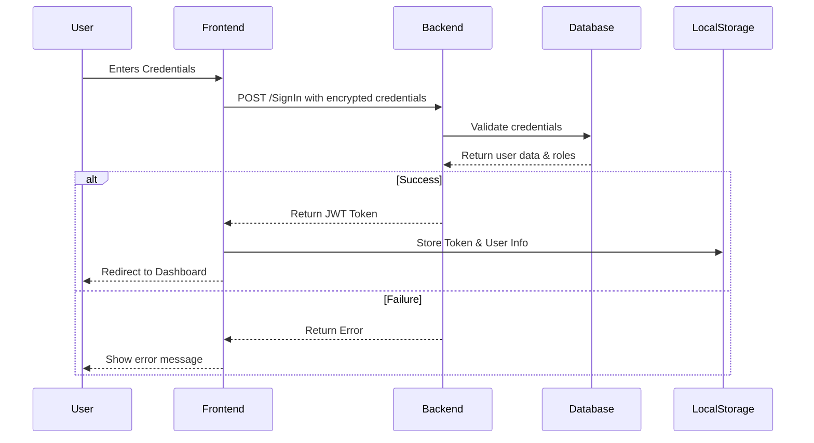
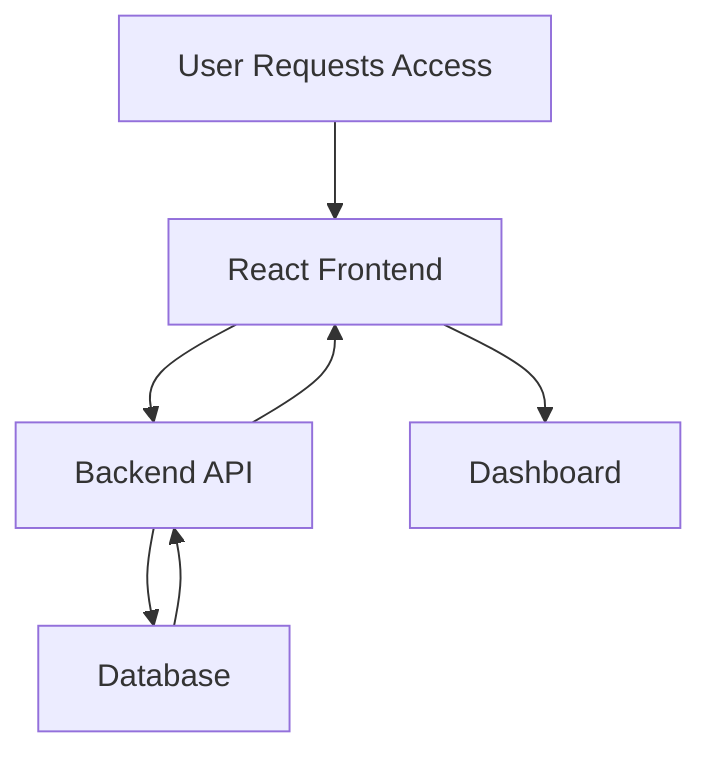
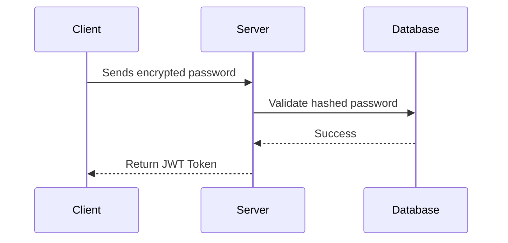

# FrontEnd Project ManageEmployees | React with Next.js

## **Table of Contents**

- 📂 [Module Overview](#module-overview)
- 📂 [How to Run the Frontend](#run)
- ⚙️ [Features Implemented](#features-implemented)
  - 🔑 [Authentication Module](#authentication-module)
  - 📦 [User Information Storage](#user-information-storage)
  - 🖥️ [Post-login System](#post-login-system)
- 📊 [Homepage (Employee Management Dashboard)](#homepage)
  - 📋 [Key Features](#key-features)
- 📜 [Business Rules for Employee Management](#business-rules-for-employee-management)
  - ➕ [Create Employee](#create-employee)
- 🔔 [Notifications](#notifications)
- 🔧 [Environment Variables](#environment-variables)
- 🔄 [Authentication Workflow](#authentication-workflow)
- 📈 [Homepage Workflow](#homepage-workflow)
- 🔥 [Toast Notifications](#toast-notifications)
  - 🎉 [Example](#example)
- 📦 [Dependencies](#dependencies)
- 🛠️ [Scripts](#scripts)
- 🛡️ [Business Rules Validation](#business-rules-validation)
- 🔐 [Security Measures](#security-measures)

## **1. Module Overview** <a id="module-overview"></a>

The frontend module of the employee management system was developed using **React** with **Next.js** to consume the backend API. It focuses on user authentication, employee management, and user interface features such as filtering, adding, and managing employees.

---

## **How to Run the Frontend** <a id="run"></a>

### **Steps to Set Up and Run the Frontend**

1.  **Clone the repository:**
    
    ```bash
    git clone https://github.com/em2websolution/ManageEmployees.Front
    ```

2. **Install Dependencies**:
   - Ensure you have **Node.js** installed on your machine.
   - Navigate to the frontend project directory in your terminal and run:
     ```bash
     npm install
     ```

3. **Configure Environment Variables**:
   - Create a `.env.local` file in the root of the project if it does not already exist.
   - Add the required environment variables. Example:
     ```dotenv
      NEXT_PUBLIC_VERSAO=1.0.0
      NEXT_PUBLIC_BASE_URL=https://localhost:64715/
      NEXT_PUBLIC_SECRET_ENCRYPT_KEY=@my-secret-key-@
     ```

4. **Run the Development Server**:
   - Start the local development server:
     ```bash
     npm run dev
     ```
   - The frontend will be available at [http://localhost:3000](http://localhost:3000).

5. **Build for Production**:
   - To generate the production build, run:
     ```bash
     npm run build
     ```
   - Then, start the production server with:
     ```bash
     npm run start
     ```

---

### **Default User Credentials** <a id="default-user-credentials"></a>

To simplify access during development, the system provides a **default user** for login:

- **Username**: `admin@company.com`
- **Password**: `Admin123!`

---


## **2. Features Implemented** <a id="features-implemented"></a>

### **1. Authentication Module** <a id="authentication-module"></a>
- **Integration with Backend**: The login module authenticates the user via the backend API.
- **Axios Adapter for HTTP Requests**:
  - All requests are managed using an `Axios` instance.
  - After login, the token obtained from the backend is automatically set in the `Authorization` header for all subsequent requests.
  - **Sensitive Data Security**: Passwords are encrypted before being sent to the backend, ensuring protection against man-in-the-middle attacks.

### **2. User Information Storage** <a id="user-information-storage"></a>
- On successful login:
  - User and token information are stored securely in `localStorage`.
  - The `Authorization` header is updated to ensure authenticated communication with the backend.

### **3. Post-login System** <a id="post-login-system"></a>
- Displays a **Header** with:
  - The logged-in user's **name** and **role**.
  - A **logout button** to terminate the session and clear stored user data.

---

## **3. Homepage (Employee Management Dashboard)** <a id="homepage"></a>

### **Key Features** <a id="key-features"></a>
1. **Employee Grid**:
   - Displays a list of employees retrieved from the backend.
   - Includes actions for editing or deleting employees.
2. **Filters**:
   - Allows users to search for specific employees within the grid.
3. **Add Employee Button**:
   - Opens a form to create a new employee, adhering to the business rules.



----------

## **4. Business Rules for Employee Management**  <a id="business-rules-for-employee-management"></a>

### **Create Employee** <a id="create-employee"></a>

-   **Fields and Rules**:
    -   **First and Last Name**: Required.
    -   **Email**: Required and unique.
    -   **Document Number**: Required and unique.
    -   **Phone Numbers**: Must have more than one contact.
    -   **Manager Name**: Required (_Manager can be an employee_).
    -   **Role Validation**:
        -   Employees cannot create users with higher roles than their own.
    -   **Password**: Follows best security practices.
    -   **Age Restriction**: Validate that the person is not a minor.

----------

## **5. Notifications** <a id="notifications"></a>

-   **React Toastify** is used to provide real-time alerts.

```javascript
toast.success("Employee added successfully!");
toast.error("Failed to fetch employees!");

```

----------

## **6. Environment Variables** <a id="environment-variables"></a>

```dotenv
NEXT_PUBLIC_VERSAO=1.0.0
NEXT_PUBLIC_BASE_URL=https://localhost:64715/
NEXT_PUBLIC_SECRET_ENCRYPT_KEY=@my-secret-key-@

```

----------

## **7. Authentication Workflow** <a id="authentication-workflow"></a>



----------

## **8. Homepage Workflow** <a id="homepage-workflow"></a>



----------

## **9. Toast Notifications** <a id="toast-notifications"></a>

### **Example** <a id="example"></a>

```javascript
toast.success("Login successful!");
toast.error("Invalid credentials!");

```

----------

## **10. Dependencies** <a id="dependencies"></a>

-   **React**: v18.3.1
-   **Next.js**: v15.1.2
-   **Axios**: v1.6.8
-   **React Toastify**: v10.0.5
-   **MUI**: v6.2.1
-   **TailwindCSS**: v3.4.17

----------

## **11. Scripts** <a id="scripts"></a>

```json
"scripts": {
  "dev": "next dev --turbopack",
  "build": "next build",
  "start": "next start"
}

```

----------

## **12. Business Rules Validation** <a id="business-rules-validation"></a>

-   **Password Validation**
-   **Age Restriction**
-   **Role Hierarchy Control**

----------

## **13. Security Measures** <a id="security-measures"></a>

-   **JWT Token Security**
-   **Password Encryption in Payload** (protects against MITM attacks)
-   **Secure HTTP Headers**


